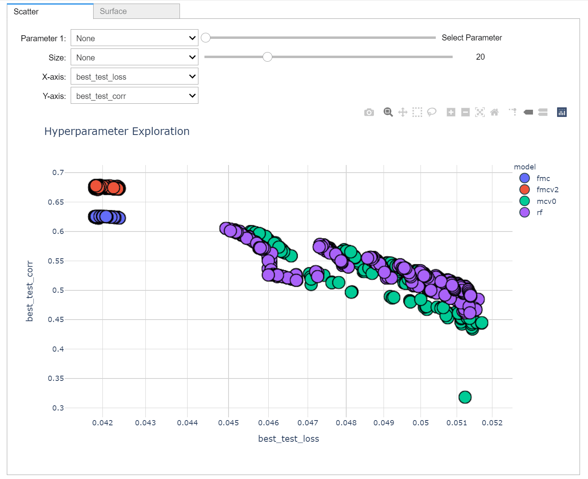

# HyperInteractive
Interactive ipywidget and plotly framework for exploring hyperparameter tuning results



## Requirements
plotly == 4.12.0 <br>
ipywidgets == 7.5.1

## Getting started
Clone repo and cd into the project directory

```
$ git clone https://github.com/oaoni/HyperInteractive.git
$ cd HyperInteractive
```

Launch in a classic jupyter notebook

```
$ jupyter notebook
```

## Usage

```
import pandas as pd
from interactivehyper import hyperExplore

data = pd.read_csv('./demo/modeltune.csv')

initial_axis = ['best_test_loss','best_test_corr']
initial_surface_axis = ['mu','alpha','best_test_corr']
legend_group = 'model'
hover_items = ['learning_rate','alpha','mu']

tab = hyperExplore(data,initial_axis,initial_surface_axis,legend_group,hover_items)
tab
```
